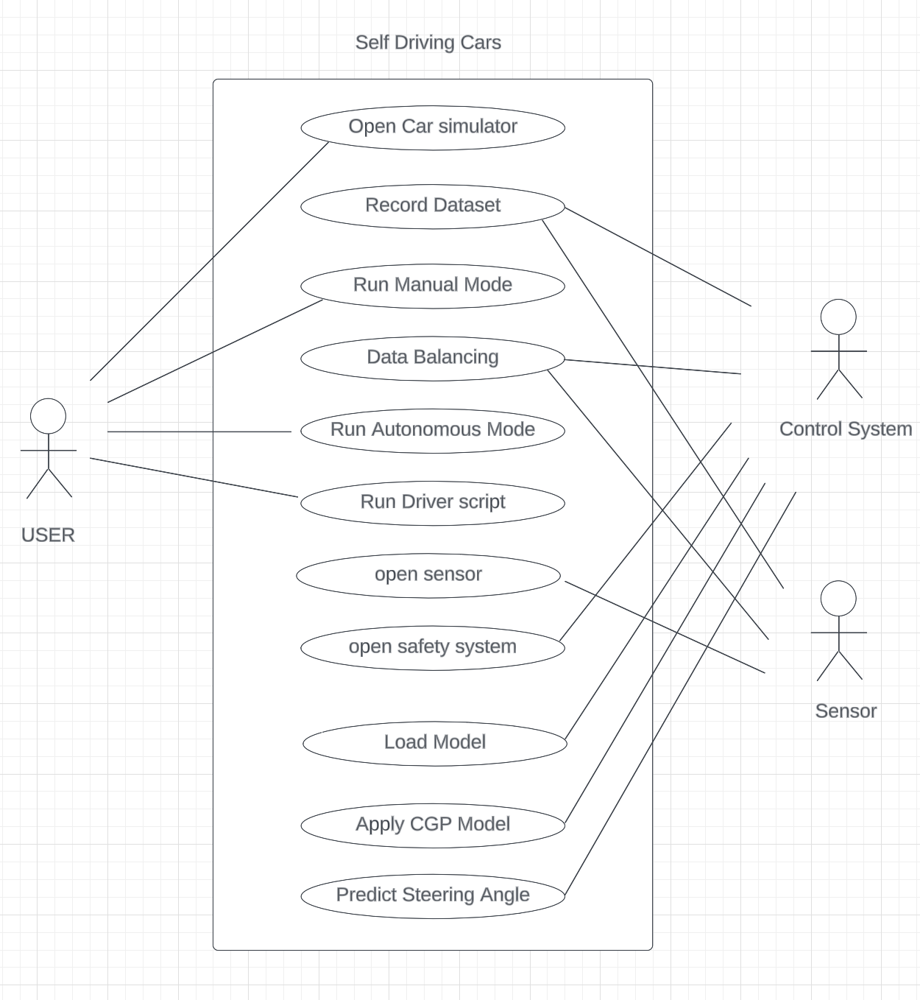
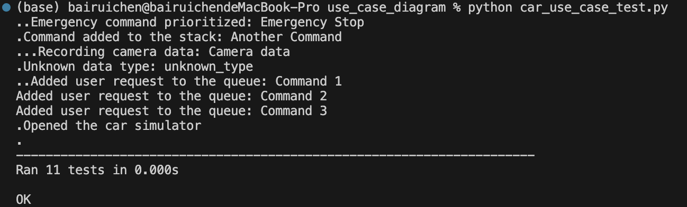
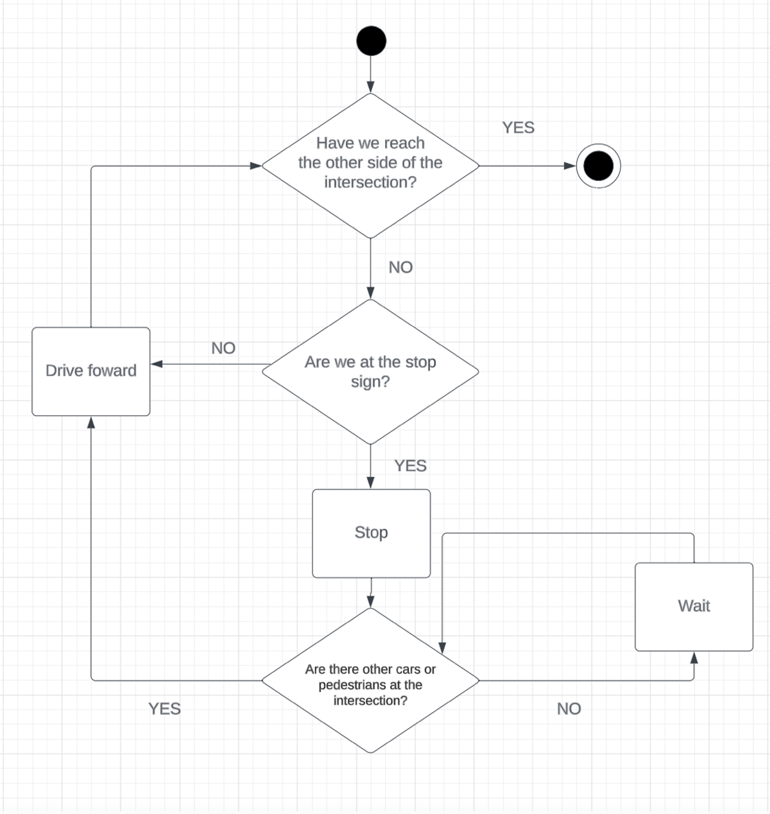
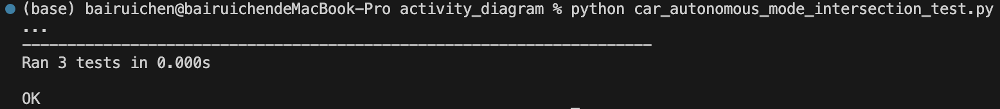
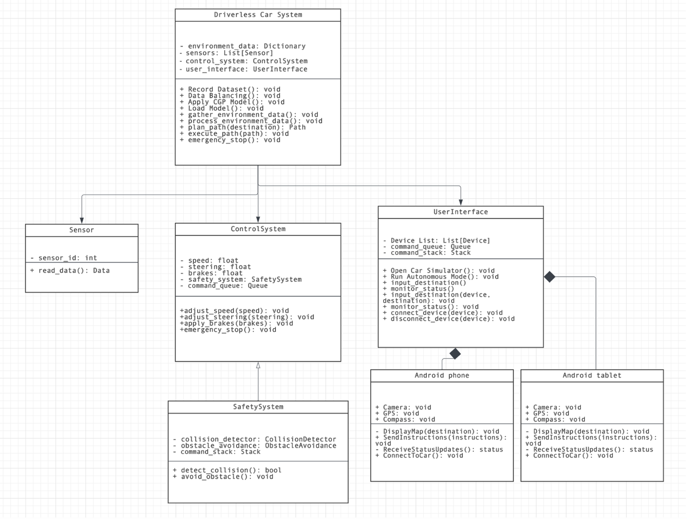
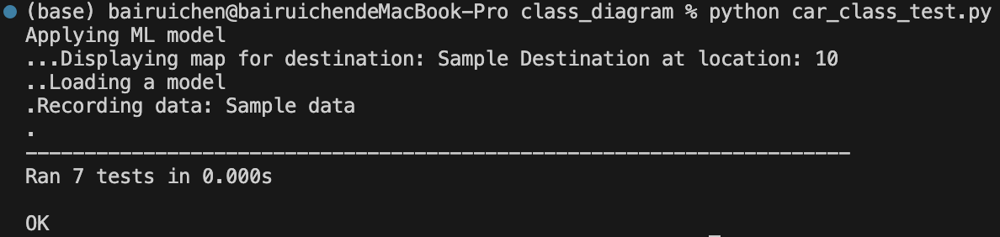
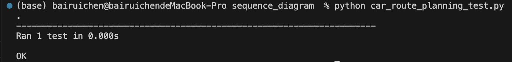
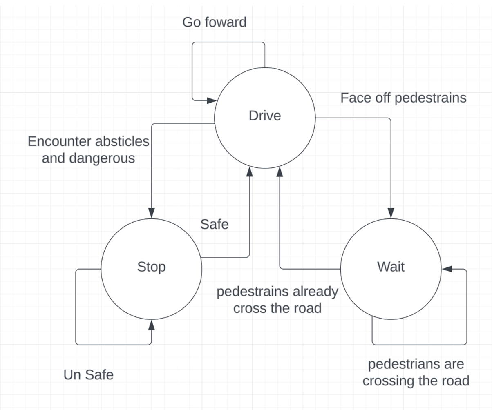
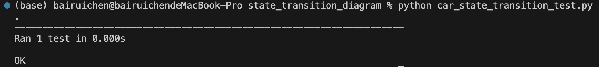

### Use Case Diagram

Use Case Diagram: This diagram illustrates the use cases of self-driving between user and system.

### Use cases:
Simulates a basic driverless car system. It defines several classes, including CarSimulator, Sensor, ControlSystem, Observer, MyObserver, and User. These classes represent components of the car system, such as the car's simulator, various sensors (camera, GPS, environmental), the control system, and user interactions.

The Sensor class records data from different sensors, notifies observers when new data is available, and balances the recorded data. The ControlSystem class manages the car's speed, steering, and user commands, including handling emergency signals. The User class allows users to interact with the system by sending commands.

### Test Cases
Unit testing script that tests various functionalities of the driverless_car_system.py classes. It includes test cases for opening/closing the car simulator, adding/removing observers from sensors, recording sensor data, and executing user commands. The tests ensure that the system behaves as expected, validating its functionality and reliability.

### Unit test Log:

### Activity Diagram

Activity diagrams depict the flow of cross intersection activities within the self-driving system. 

### IntersectionLogic Class
The IntersectionLogic class represents the decision-making logic of a self-driving car at an intersection. It has attributes that control the car's behavior, such as whether it has reached the other side of the intersection, whether it is at a stop sign, and whether there are other cars or pedestrians at the intersection. The get_intersection_action method executes the decision-making process.

### Test Cases
The test script sets up test cases to verify the correctness of the IntersectionLogic class. The tests cover scenarios where the car needs to stop, wait, or continue driving based on various conditions at the intersection.

Unit test Log:

### Class Diagram

The Driverless Car System simulates the operations of a driverless car, including control systems, sensors, and user interfaces.

### Test case
To ensure that the state transitions of the Car class work correctly

Class diagrams represent the classes and their relationships within the system, including classes for sensors, control systems, and user interfaces.
### Unit test Log:

### Sequence Diagram

Sequence diagrams show the interactions and message exchanges between objects and components during route planning scenarios.

### Classes and Interactions
**CarStimulator:** Represents opening the car for autonomous mode and running it autonomously.

**DriverScript:** Establishes a connection, passes sensor data, loads a machine learning model, and sends control commands.

**MLModel:** Analyzes data and predicts a path.

**Simulation**
The simulate_sequence() function simulates the sequence of interactions:

1. Open the car
2. Connection established
3. Run Autonomous
4. Pass sensor data and Load GCP ML Model
5. Model analyzes data
6. Predict path
7. Send Control

### Test case
Unit tests in car_route_planning_test.py ensure that the simulated sequence matches the expected sequence for autonomous car route planning.

### Unit test Log:

### State Transition Diagram

State transition diagrams model the different states and transitions of the autonomous car, including waiting, driving, and emergency stop states.

### Car State Transition
This module contains a Python class, Car, that models the state transitions of a car. The state transitions represent the car's behavior in response to different situations it may encounter while driving. The module uses an enumeration, CarState, to define the possible states of the car.

### Car States
The Car class has the following states and corresponding methods to transition between them:

**DRIVE**: Represents the normal driving state.
**Method**: **go_forward**

**WAIT**: Represents the state when the car faces pedestrians or encounters obstacles and needs to wait.
**Methods**: **face_pedestrians**, **pedestrians_already_cross_road**, **pedestrians_are_crossing_road**

**STOP**: Represents the state when the car encounters obstacles and comes to a stop.
**Methods**: **encounter_obstacles**, **is_safe**, **is_unsafe**

### Test case
To ensure that the state transitions of the Car class work correctly, this module includes unit tests in the car_state_transition_test.py file. The tests cover various scenarios and transitions between states.

### Unit test Log:

### References:
IBM. (2023). The Class Diagram. [Online] Available at: https://developer.ibm.com/articles/the-class-diagram/ (Accessed 20 October 2023).
Takaaki M. (2023). UML Diagram for GoF Design Pattern Examples in Python. Dev.to. [Online] Available at: https://dev.to/takaakit/uml-diagram-for-gof-design-pattern-examples-in-python-4j40 (Accessed 21 October 2023).
